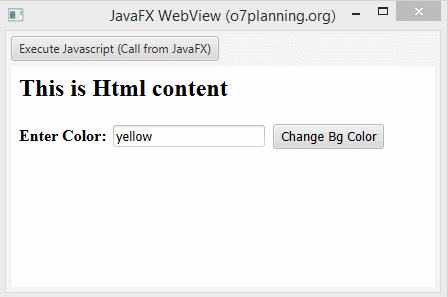

# Advanced Object Oriented Computing Project

**Title:** Items Application Manager  
**Name:** Patrick Murphy  
**Student ID:** G00123456  
**Screencast Link:** [https://youtu.be/AbCdEf12345](https://youtu.be/AbCdEf12345)

## Application Function

> **Scope:** what your app does for the *user* — its features and how someone uses it. (Keep code structure for *Application Architecture* and UI design for *JavaFX*.)

Discuss, in detail, what the application does. Add a screenshot of the application **in use** (note: this is a *different* image to the architecture screenshot further down). 

## Running the Application

Provide step by step instructions on how to run your application. Are there any software installs required? 

For example:

1. Open the repository in **GitHub Codespaces**.
2. Install the **Extension Pack for Java** when prompted.
3. Open the `Main` class.
4. Click the **Run** icon in the top-right corner.
5. *(add any further steps, and note any software that must be installed)*

## Project Requirements

All requirements live in **one place** — the [**project brief**](project-brief.md). 

See: 
1. Minimum Project Requirements 
2. Minimum Feature Requirements
3. Coding Standards

Make sure you have met every one and documented everything here before you submit.

## Project Requirements Above and Beyond

Discuss any application features or design elements that show you went above and beyond the basic requirements.

## Application Architecture

> **Scope:** the *code* — your classes, their methods, and the data structure(s) (e.g. the `ArrayList`) used to store your objects. (Keep user-facing features for *Application Function* and UI design for *JavaFX*.)

Discuss in detail how the application is structured. List all classes. List their methods and what they do. Discuss what structures are used to store data objects.

Add a screenshot or diagram of the application architecture, e.g. a class diagram (a *different* image to the in-use screenshot above).

## JavaFX

> **Scope:** the *UI design* — layout, navigation, styling, and why you chose them. (Keep what the app does for *Application Function* and the code structure for *Application Architecture*.)

Discuss the GUI design used. Discuss why you chose this design and any features you think make your application stand out.

## Roadblocks and Unfinished Functionality

Discuss the issues you faced with creating your application. Provide possible solutions to these issues. What would you have done differently if you had to do this again? What did you not get finished?

## Resources

Provide links to resources used:

* [Tutorialspoint](https://www.tutorialspoint.com/java/) - Java Tutorials site I found helpful
