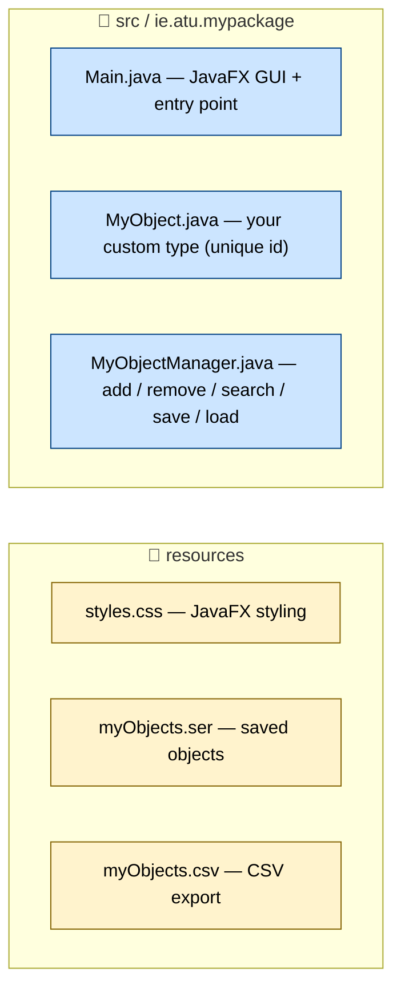
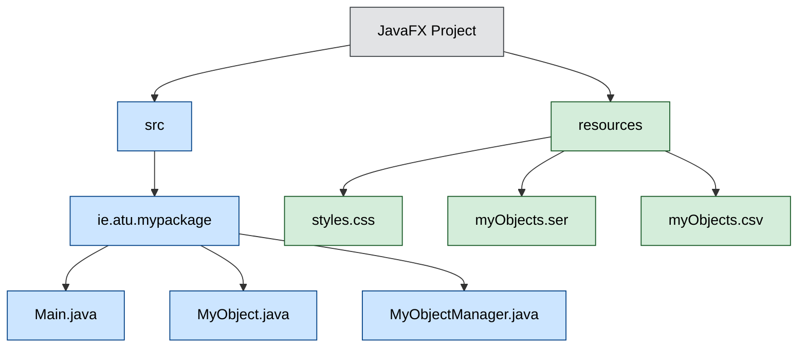
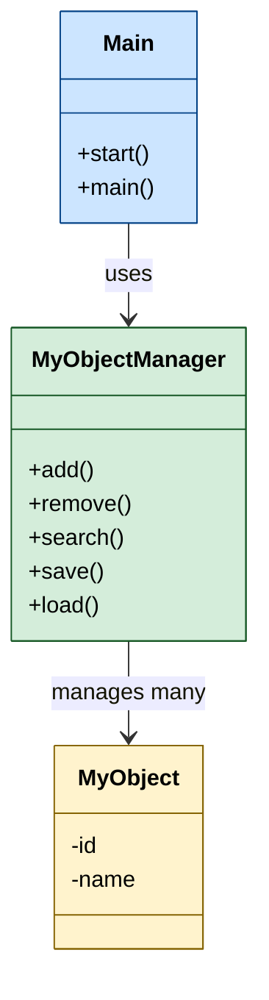
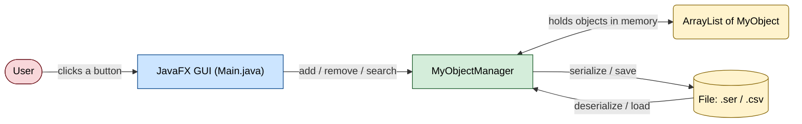
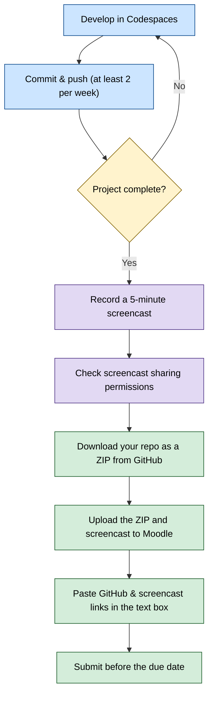

# AOOC - Project Assessment

## Agenda
1. [Introduction](#1-introduction)
2. [Minimum Project Requirements](#2-minimum-project-requirements)
3. [Minimum Feature Requirements](#3-minimum-feature-requirements)
4. [Coding Standards](#4-coding-standards)
5. [Enhanced Features](#5-enhanced-features)  
6. [Project Submission Process](#6-project-submission-process)  
   6.1. [Screencast Demonstration](#61-screencast-demonstration)  
   6.2. [Moodle Submission](#62-moodle-submission)
7. [Important Notes](#7-important-notes)
8. [Grading Rubric](#8-grading-rubric)

---

## 1. Introduction

For this project you are required to design and develop a JavaFX GUI (Graphical User Interface) application. The application must manage objects of a custom type that you choose (e.g. `Car`, `Phone`, `Book`).

Your custom type must have **one instance variable that uniquely identifies each object** (e.g. a registration plate number for a car, an IMEI number for a phone, or an ISBN number for a book). You will use an `ArrayList` to store and manage these objects.

You may use AI to assist in the development of your code, but you must be able to explain how your code works in the mandatory screencast video that you supply with your submission.

---

## 2. Minimum Project Requirements

1. **Use this template repository** to create your own GitHub repository, which you will use to track your application development. This repository must contain all documentation, application code, and any resources (e.g. input/output files, images, etc.) used by your application.
   - No materials outside of your GitHub repository are gradable.
   - Not using GitHub at all for this project will cap your grade at **40%**.
2. **Develop in GitHub Codespaces**, exactly as we did in the labs.
3. **Commit regularly.** Your repository must have **at least two commits per week** (in practice, you should commit many times per coding session). If you do not commit regularly, I may contact you for a live project demonstration; failing to attend this meeting will cap your grade at **40%**.
4. **Complete the README.** It must contain clear instructions for compiling, deploying, and running the application, and briefly outline the nature of the project and the features it contains. All sections of the README template must be filled out — you may add more sections if you wish.

> **Not sure about any of the above?** Email me **before** you begin your project.

---

## 3. Minimum Feature Requirements

Your application must include, at minimum, the following:

- **Three classes:**
  - A `Main` class that holds the JavaFX code.
  - A class that defines the custom object you choose (e.g. `Book`).
  - A manager class for those objects (e.g. `BookManager`).
- An **`ArrayList`** (from the Java Collections Framework) to store your custom objects.
- A **manager class** that can `add`, `remove`, `serialize`, `deserialize`, find the `total`, and `search` for objects in the `ArrayList`.
- **Stream API** usage, mainly to help with searching and with streaming the `ArrayList` to a file. At least one **lambda expression** must be used with a stream.
- **File I/O** to save your `ArrayList` to a file and to read objects back from a file.
- **Exception handling** to manage the file I/O safely.
- **Serialisation** of objects to a file.
- A **JavaFX GUI** defined in the `Main` class.

### Suggested project structure

> **Three styles of the same structure are shown below so you can compare them. Pick the one you prefer and delete the other two.**

#### Option A — ASCII tree (simple, edit by hand)

```text
aooc-project-template/
├─ src/
│  └─ ie/atu/mypackage/
│     ├─ Main.java              JavaFX GUI + program entry point
│     ├─ MyObject.java          your custom type (has a unique id)
│     └─ MyObjectManager.java   add / remove / search / save / load
└─ resources/
   ├─ styles.css                JavaFX styling (optional)
   ├─ myObjects.ser             objects saved by serialisation
   └─ myObjects.csv             objects exported as CSV
```

#### Option B — colour folder diagram (Mermaid subgraphs)



#### Option C — top-down tree (Mermaid graph)



### How the classes relate



### How data flows through the app



---

## 4. Coding Standards

- Your code **must compile**.
- Use **consistent code formatting** throughout.
- **Comment your code.** At a minimum, comment every class and every method.

---

## 5. Enhanced Features

To achieve a high grade, go beyond the minimum requirements:

- Add **extra manager methods** that you have researched yourself (e.g. a method to sort objects), and document them in your README.
- Add **JavaFX features** that were not demonstrated in the labs.
- Create an **animated GIF** of you using your application and add it to your README.
- Create an **executable JAR file** that launches your application independently on Windows, and include it in your GitHub repository.

---

## 6. Project Submission Process

You **must** follow this submission process carefully. If you miss any part — especially the screencast — you will be penalised.



### 6.1. Screencast Demonstration

- Record a **5-minute** screen recording using [MS Stream](https://www.microsoft365.com/launch/stream), YouTube, or any tool of your choosing.
- Download the screencast video file so you can upload it to Moodle alongside your code.
- In the screencast you should:
  - Demonstrate your app running and its operation.
  - Give a brief code walkthrough, highlighting the places where you expended most of your effort.
  - Highlight any additional functionality you implemented.
- **MAKE SURE YOUR SCREENCAST IS ACCESSIBLE BY ME.** Check your Stream/OneDrive permissions and confirm that it can be viewed by me. It is your responsibility to ensure I can see the screencast. If I cannot, your grade will be capped at **40%**.

### 6.2. Moodle Submission

1. [Download a copy of your final Git repository from the GitHub website.](https://youtube.com/shorts/4bDLccFjQyc?si=dWUDWoW4B_tnADty)
2. Upload the ZIP file of your code **and** your screencast video to the submission link on Moodle (found under the **Final Project** section).
3. In the submission text box, paste the URL of your GitHub repository **and** the URL of your MS Stream screencast recording (see the sample below).
4. Submit before the due date. Late submissions incur a **10% penalty per day**.

#### Sample Textbox Input

<pre>
<b>Screencast Link:</b> https://atlantictu-my.sharepoint.com/:v:/g/personal/daniel_cregg_atu_ie/Ed9h1upB77VFuIm0ezGYj8MBlOaHCoiWUJkLUFqj0Z9OJQ?e=ua2JM1
<b>GitHub Link:</b> https://github.com/DanielCreggOrganization/ooc2-final-project-2021-annmurphy
</pre>

---

## 7. Important Notes

1. Only materials within your GitHub repository will be graded. *(40% grade cap if missed.)*
2. Insufficient commits may require a live demonstration. *(40% grade cap if missed.)*
3. Late submissions incur a **10% penalty per day**.

---

## 8. Grading Rubric

| Area | Poor<br>(0-39) | Fair<br>(40-49) | Good<br>(50-59) | Very Good<br>(60-69) | Excellent<br>(70-100) |
|------|----------------|-----------------|-----------------|---------------------|---------------------|
| **UI/UX** | • Basic template-like<br>• Minimal effort<br>• Poor navigation<br>• Inconsistent design | • Basic effort shown<br>• Meets minimums<br>• Navigation works<br>• Shows competency | • Consistent design<br>• Intuitive navigation<br>• Beyond basic requirements | • Bespoke elements<br>• Consistent design<br>• Fluid navigation<br>• Above requirements | • Professional finish<br>• Innovative design<br>• Flawless UX<br>• Cohesive elements<br>• Exceeds requirements |
| **Technical** | • Inconsistent code<br>• Unfinished sections<br>• Poor formatting | • Basic competence<br>• No new elements<br>• Meets minimums | • Good structure<br>• Technical mastery<br>• Minor added extras | • Professional code<br>• Clean architecture<br>• Consistent style | • Excellence shown<br>• Advanced features<br>• Perfect structure |
| **Docs** | • Basic README<br>• Few commits<br>• Poor submission | • Basic sections done<br>• Sporadic commits<br>• Meets minimums<br>• Minimal comments | • Good GitHub usage<br>• Detailed README<br>• Regular commits<br>• Clear comments | • Bespoke content<br>• Clean repo<br>• Detailed docs | • Professional docs<br>• Rich media<br>• Perfect GitHub use<br>• Research depth |
</content>
</invoke>
